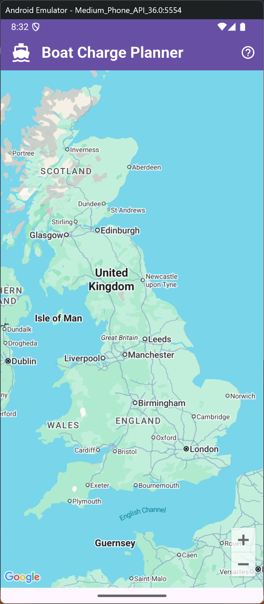
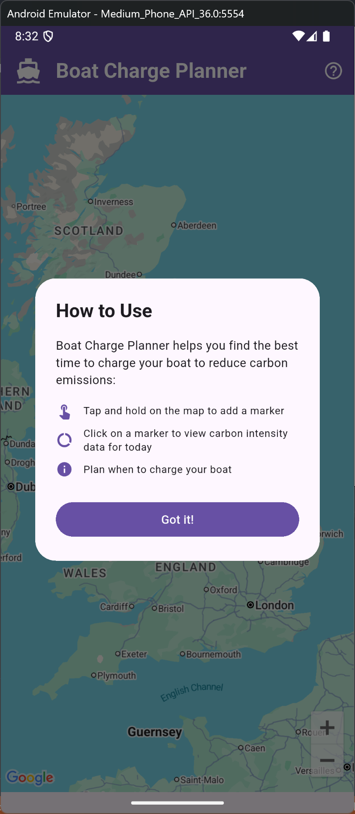
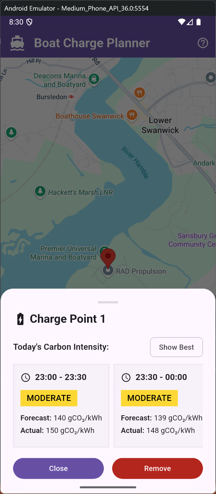
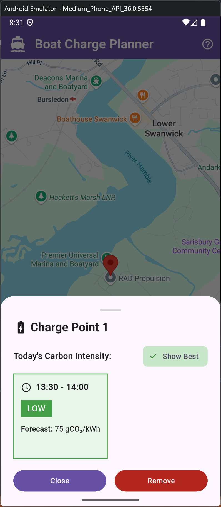
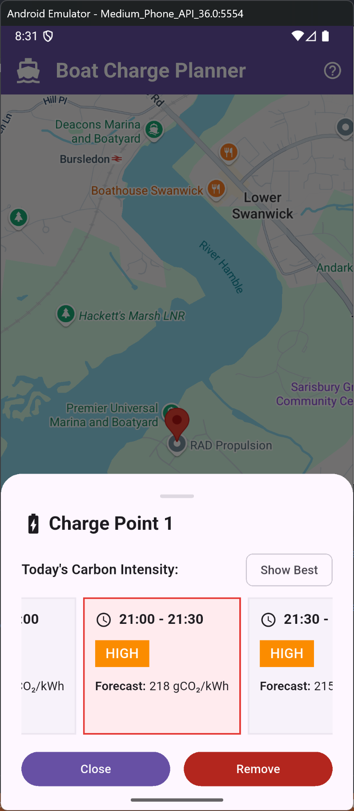

# Boat Charge Planner

A Flutter mobile application for planning boat charging based on the Carbon Intensity API.

## Project Overview

This app helps users plan when to charge their boats by displaying:

- An interactive map focused on the UK
- Carbon intensity data for selected locations
- Predicted carbon intensity graphs for optimal charging times

## Screenshots

  
  
<em>Interactive map with UK focus</em>

  
  
  
<em>Help and guidance section</em>

  
  
  
<em>Location marker with carbon intensity data</em>

  
  
  
<em>Filter and search functionality</em>

  
  
  
<em>High carbon intensity warning</em>

## Implementation Steps

### Phase 1: Project Setup & Dependencies

1. **Add required dependencies to `pubspec.yaml`:**

   - `google_maps_flutter` - for displaying the map
   - `http` - for API calls to get carbon intensity data
   - `fl_chart` - for displaying the carbon intensity graphs
   - `geolocator` - for handling location services

2. **Configure platform-specific settings:**
   - Android: Add Google Maps API key to `android/app/src/main/AndroidManifest.xml`
   - iOS: Add location permissions to `ios/Runner/Info.plist`

### Phase 2: Core Map Implementation

3. **Create the main map screen:**

   - Replace the default counter app with a map-focused interface
   - Set initial camera position to UK (approximately 54.0, -2.0)
   - Implement pan and zoom functionality

4. **Add map interaction handling:**
   - Implement long press detection on the map
   - Add pin placement functionality when user long presses

### Phase 3: Carbon Intensity Data Integration

5. **Research and integrate Carbon Intensity API:**

   - Create data models for carbon intensity information
   - Implement API service class for fetching data

6. **Create carbon intensity display:**
   - Design a pin/info window that shows current carbon intensity
   - Display the intensity value with appropriate units (gCO2/kWh)

### Phase 4: Graph Implementation

7. **Implement carbon intensity prediction graph:**

   - Use `fl_chart` to create a line chart
   - Show predicted carbon intensity over time (next 24-48 hours)
   - Add proper styling and labels

8. **Create pin information overlay:**
   - Design a modal or overlay that appears when pin is tapped (infowindow)
   - Include both current intensity and the prediction graph
   - Add close functionality

### Phase 5: UI/UX Polish

9. **Enhance the user interface:**

   - Add proper app title and branding
   - Implement loading states for API calls
   - Add error handling for failed API requests
   - Style the map pins and information displays

10. **Potential additional features:**
    - Implement pin management (remove pins, list all pins)
    - Add search functionality for specific UK locations
    - Include a legend or help section explaining carbon intensity values

### Phase 6: Testing & Debugging

11. **Test the application:**

    - Test on both Android and iOS simulators
    - Verify map interactions work correctly
    - Test API integration and error handling

12. **Prepare for demo:**
    - Practice using VS Code debugger and toolchain
